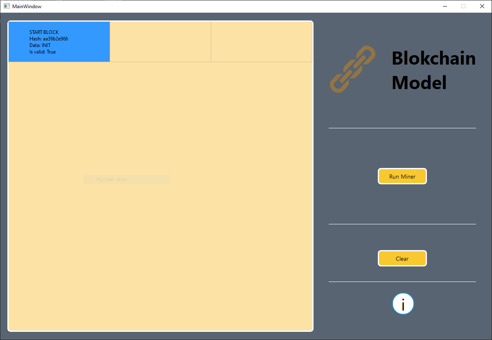
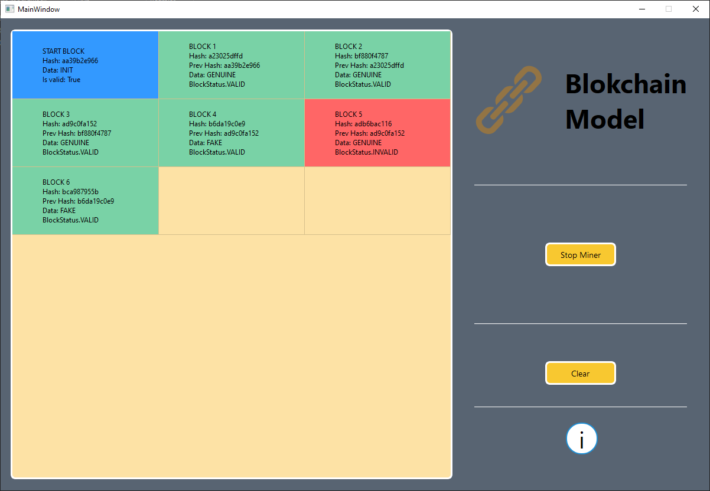
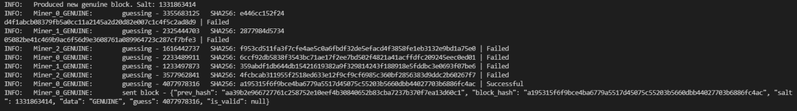

# Ochrona Danych (Data Security)

## About

This is studies project for Data Security course where project topic is blockchain.

### What is blockchain?

Blockchain is a digital public ledger that records transactions. It is a distributed ledger that can be queried and verified. It is a public record of past transactions.

### How blockchain works

Blockchain works based on hash function and proof of work. Hash function is used to generate hash value and proof of work is used to verify hash value.

### What is hash function

Hash function is used to generate hash value.

### What is proof of work

Proof of work is form of cryptographic proof that verifies the longeset chain of blocks.

### What is 51% attack

51% attack is a type of attack in which attackers control more than half of the network mining hash allowing them to input fake blocks also controlling other miners from completing valid blocks (gaining confirmations).

## How to run this project

To run this project you need to install pip and then run:

```bash
python -m pip install -r requirements.txt
```

After that to run project simply call:

```bash
python ./app/GUI/gui.py
```

And window with UI should be opend displaying staring block as well as buttions to start mining and stop mining and clear button.

## How program works

Starting screen is displayed with starting block.
This is shown in UI screen below.



Working progress is shown in UI screen below, as miner works blocks are added and displayed. Invalid block is shown in red color, valid block are in green, and any conflicting blocks (conflict means that there are blockchain of the same length) is shown in orange.



Working miner displayis information in console running in parallel with UI in the background but visible. There are show informations about miners as well as blocks.



## How to miner works

Miner is a program that is running in background and is mining blocks. It is running in parallel with UI communicating with it using sockets. Miner app is a single thread and it is running in a for loop to result in more consistent flow of computing power.

## Miner parameters

There are parameters that can be change before running the program inside `/miner/miner.py` file. List below shows all parameters and their default values as well their description.

```python
# Maximum difference in blockchains length between valid blocks mined by genuine miners and invalid blocks
MAX_FAKE_FALLBEHIND: int = 5
# Number of fake miners that will try place invalid blocks
FAKE_MIMERS_COUNT: int = 2
# Number of normal miners that will try place valid blocks
GENUINE_MINERS_COUNT: int = 3
# Delay between each block hash guess in seconds
SLEEP_SECONDS: int = 0.5
# Delay in blockchains after normal miners starts mining
FAKE_MINERS_DELAY_COUNT: int = 2
```

